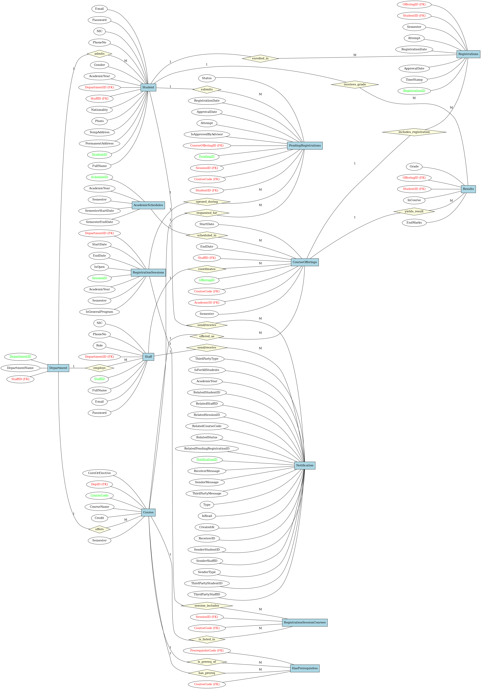
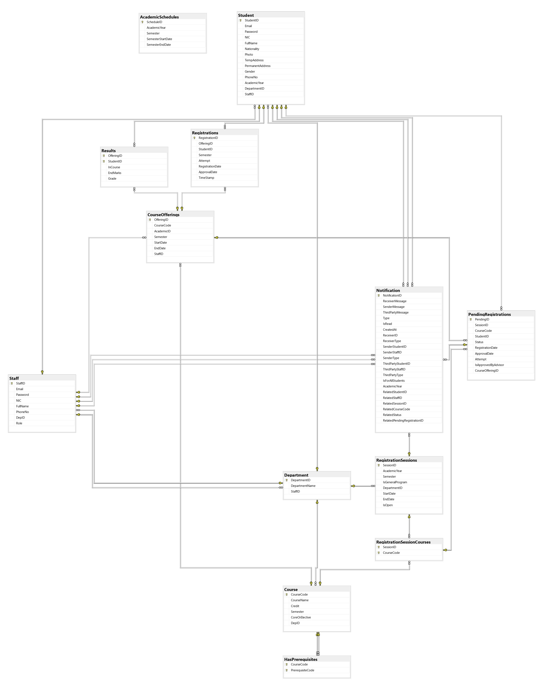
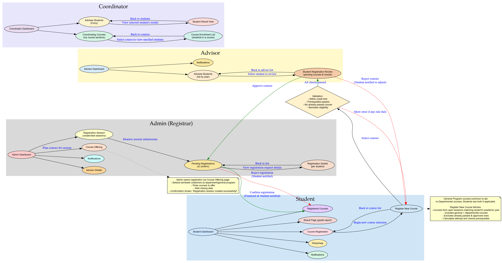

# 🎓 FOE Course Registration System

The **FOE Course Registration System** is a role-based, web-based application developed using **ASP.NET Core MVC** and **Microsoft SQL Server**, designed to streamline **student course registration** while providing tools for **advisors** and **administrators (registrars)** to manage approvals and academic records efficiently.

---

## 📚 Project Overview

This system supports:
- Students registering for available courses each semester.
- Advisors reviewing and approving/rejecting student registrations.
- Admins (Registrar) managing academic schedules, registration sessions, course offerings, and confirming final registrations.

> 🔐 The system enforces **authentication and authorization** for all user roles with a focus on usability and academic integrity.

---

## 🚀 Key Features

- 🧑‍🎓 **Student Dashboard**
  - Register for available courses
  - View past and current registration status
  - Access result records
  - Receive real-time notifications

- 🧑‍🏫 **Advisor Dashboard**
  - View assigned students and their course requests
  - Approve or reject course registrations
  - Send feedback or instructions via notifications

- 🧑‍💼 **Admin (Registrar) Dashboard**
  - Create/view registration sessions
  - Define course offerings for each semester
  - Confirm or reject final registrations

- 🔐 **Authentication & Roles**
  - Secure login for Students, Advisors, and Admins
  - Role-based access to features and data

---

## 🛠️ Technologies Used

- **Backend**: ASP.NET Core MVC, Entity Framework Core  
- **Frontend**: Razor Views, Bootstrap, jQuery  
- **Database**: Microsoft SQL Server  
- **Authentication**: ASP.NET Identity with Cookie-based login  
- **Documentation**: PDF, ER & Schema Diagrams, UI Flow

---

## 🗃️ Database Design

The database follows a normalized relational schema with key entities including:
- `Student`, `Staff`, `Course`, `CourseOffering`
- `PendingRegistrations`, `Registrations`, `Results`
- `Notification`, `AcademicSchedules`, `RegistrationSessions`
- Relationship mapping with foreign keys and M:N associations like prerequisites and offerings.

📎 Refer to diagrams below:

### 📌 ER Diagram

### 📌 Database Schema

---

## 🧭 UI & System Flow

The system interface is designed for clarity and efficiency. Each role has a separate dashboard to interact with the system.

### 📌 UI and System Flow

---

## 📂 Documentation

- 📄 [Final System Documentation (PDF)](CourseRegistrationSystemDocumentation.pdf)  
- 📄 [Database Structure (PDF)](DB.pdf)

These include:
- System overview, use cases, and flow diagrams
- Advisor and Admin role scenarios
- Registration workflows and notification logic

---

## 🔗 Project Repository & Demo

- 🗃 **GitHub Repository**  
  👉 [FOE Course Registration GitHub](https://github.com/Jenarththan2001/FOE_CourseRegistrationSystem)

- 🎥 **System Demo Video**  
  👉 [Watch Demo](https://drive.google.com/file/d/17X55-fXRYbFGx7phcjz0WZI1cNXuISgS/view)

---

## ✅ How to Run

1. Clone the repository from GitHub.
2. Open the solution in **Visual Studio 2022 or later**.
3. Setup the SQL Server database using the provided `DB.pdf` and schema files.
4. Update the `appsettings.json` with your local DB connection string.
5. Run the application and login using seed credentials or register a new user.

---

## 📬 Contact

For questions or feedback, please contact the contributors via GitHub or the official email channels listed in the project documentation.
